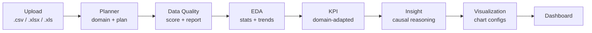
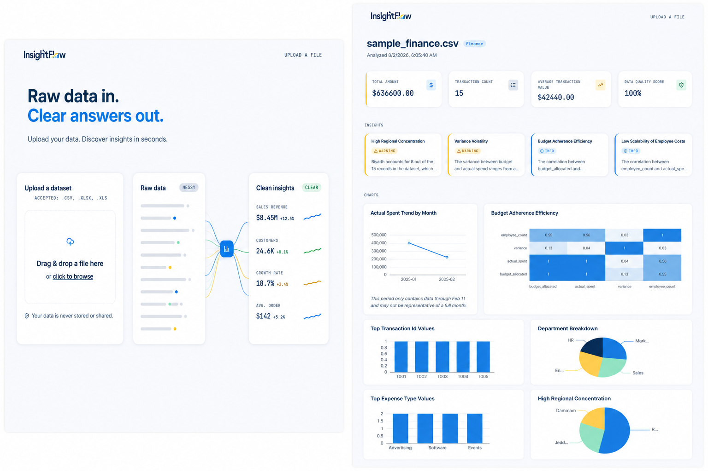

<p align="center">
  
</p>

<h1 align="center"></h1>

<p align="center">
  Upload a spreadsheet, get a data-quality report, KPIs, causal insights, and charts back — no manual analysis required.
</p>

<p align="center">
  
  
  
  
  
  
</p>

---

## ✨ Features

- **Multi-format upload** — `.csv`, `.xlsx`, `.xls`, profiled immediately on upload (shape, column dtypes, null counts, a sample of rows).
- **Automatic data-domain detection** — an LLM planner classifies the dataset as `sales`, `finance`, `complaints`, `tourism`, or `generic` and decides which downstream agents should run.
- **Data quality scoring** — missing values, duplicate rows, numeric-looking values stored as text, and IQR-based outliers, computed with pandas and rolled into a single 0–100 score with a weighted penalty formula.
- **Exploratory data analysis (EDA)** — numeric distributions, correlations, monthly time trends (with incomplete-period detection), and top-value breakdowns for categorical columns.
- **Domain-adapted KPIs** — different KPI sets are generated depending on the detected domain (e.g. Total Revenue/Average Order Value for sales, Total Amount/Transaction Count for finance, Total Complaints/Most Common Category for complaints), always including a Data Quality Score.
- **AI-generated causal insights** — an LLM turns the computed EDA/quality stats into 3–6 business insights that explain *why* a pattern matters, not just what the numbers are (grounded in the real numbers, never invented).
- **Auto-generated charts** — line (trends), bar/pie (categorical breakdowns), and heatmap (correlations) ECharts options, generated by simple rules based on the shape of the data, with insight titles reused on matching charts.
- **Resilient pipeline** — every LLM call follows a retry-once-then-fallback pattern, and a failing agent never crashes the run; the pipeline finishes as `done_with_errors` instead of halting.

## 🏗️ Architecture



Orchestration is a linear [LangGraph](https://github.com/langchain-ai/langgraph) `StateGraph` (`backend/app/orchestrator/graph.py`) over a single shared `AnalysisState` dict. Every node is wrapped so an agent's exception is caught, logged, and appended to `state["errors"]` instead of raising — the graph always reaches `END`. `run_analysis()` sets the run's final status to `"done"` if no agent recorded an error, or `"done_with_errors"` if one did, so a partial/degraded result is still returned to the frontend rather than a failed request.

## 🤖 The Agents

| Agent | What it does | LLM or computation |
|---|---|---|
| **Planner** | Classifies the dataset's domain (`sales`/`finance`/`complaints`/`tourism`/`generic`) and whether it has a time series, from the upload profile | LLM (Gemini), retry-once + safe-default fallback |
| **Data Quality** | Computes % missing per column, duplicate rows, numeric-values-stored-as-text detection, and IQR outliers per numeric column; rolls them into a weighted 0–100 score | Pure pandas/numpy — LLM only writes the 2–3 sentence human-readable summary of the already-computed stats |
| **EDA** | Computes distributions (`describe()`), correlations, monthly trends with incomplete-period flagging, and top-5 category breakdowns | Pure pandas, no LLM |
| **KPI** | Builds a domain-specific set of KPIs (different metrics per domain) from the EDA/quality output | Pure Python, no LLM |
| **Insight** | Writes 3–6 causal, business-oriented insights (with explicit few-shot good/bad examples) grounded in the real computed numbers | LLM (Gemini), retry-once + template-based fallback built directly from the stats |
| **Visualization** | Picks a chart type per data shape (line for trends, pie/bar for categoricals depending on cardinality, heatmap for correlations) and builds the ECharts option | Pure Python, no LLM |

## 🛠️ Tech Stack

**Frontend** — Next.js 14 (App Router) · TypeScript · Tailwind CSS · shadcn/ui (base-ui) · ECharts · GSAP (motion) · lucide-react

**Backend** — FastAPI · SQLAlchemy · Alembic · Pydantic / pydantic-settings · Pandas · DuckDB *(installed, reserved for heavier aggregation — current agents run entirely on pandas)*

**AI / Orchestration** — LangGraph · Google Gemini (`google-genai`, model `gemini-3.1-flash-lite`)

**Database** — PostgreSQL via Supabase

## 🚀 Quick Start

### 1. Clone and configure environment

```bash
git clone git clone https://github.com/Elham6316/insightflow-ai.git
cd insightflow-ai
cp .env.example backend/.env
```

Fill in `backend/.env`:

```
DATABASE_URL=postgresql://<user>:<password>@<host>:5432/postgres
GEMINI_API_KEY=<your-gemini-api-key>
```

### 2. Backend

```bash
cd backend
python -m venv .venv
.venv\Scripts\activate        # Windows — use `source .venv/bin/activate` on macOS/Linux
pip install -r requirements.txt
alembic upgrade head           # creates datasets, analysis_runs, agent_outputs, insights
uvicorn app.main:app --reload --port 8001
```

### 3. Frontend

```bash
cd frontend
npm install
echo "NEXT_PUBLIC_API_URL=http://localhost:8001" > .env.local
npm run dev
```

Open `http://localhost:3000`, upload a `.csv`/`.xlsx` file, and run an analysis.

## 📸 Screenshots




*(placeholder — screenshots to be added)*

## 🧠 How It Works

Every agent reads from and writes to a single shared `AnalysisState` dict as it passes through the LangGraph pipeline. There's no hidden coupling between agents — each one declares in `backend/app/orchestrator/state.py` exactly which keys it reads and writes, so the whole pipeline's data flow is visible in one file.

Every LLM-calling agent (Planner, Data Quality's summary step, Insight) follows the same pattern: call the model, validate the response against a Pydantic schema, retry once on malformed/invalid output, then fall back to a safe template-based default rather than crashing the run. This was a deliberate consistency decision — no agent invents its own error-handling approach, so failure behavior is predictable everywhere.

The pipeline also draws a hard line between deterministic computation and LLM reasoning. Data Quality and EDA never let the LLM touch the numbers — pandas computes every stat, and the LLM only ever summarizes or reasons over stats it's already been handed. This keeps the numbers you see trustworthy and reproducible, while still getting LLM-quality prose for the "why does this matter" parts of the dashboard.

## 🗺️ Roadmap

- **Cleaning Agent** — propose and apply data-cleaning fixes (not just report on quality)
- **Forecast Agent** — short-horizon forecasting for time-series datasets
- **Report Agent** — export a shareable PDF/summary report of a run
- **Reviewer Agent** — a conditional routing node that re-runs or escalates when confidence is low
- **Docker deployment** — containerized backend + frontend for one-command local/prod setup

## 📝 Development Log

Detailed technical decisions, environment fixes, and architecture notes are tracked in [`docs/DECISIONS_LOG.md`](docs/DECISIONS_LOG.md) as the project evolves.

## 📄 License

MIT — see [LICENSE](LICENSE) *(to be added)*.
